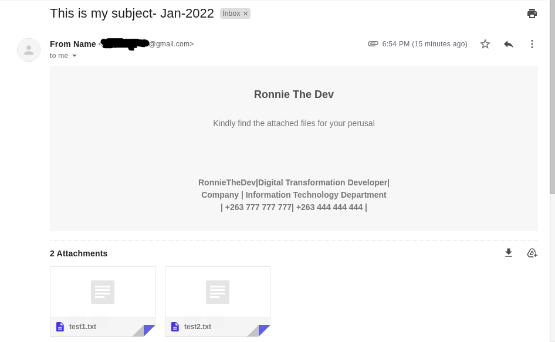

# Send-Email-with-Python

# Usage:
> If you are using this program to send emails using gmail please remember to turn on [Allow Less Secure Apps](https://myaccount.google.com/lesssecureapps). Note: some `parameters` such as `files` & `cc` are optional on the `send_email()` function. 

```python
from Email.config import send_email

to_email = ""
from_email = ""
subject = ""
message = ""
cc = [""]
host = "smtp.gmail.com"  #or any other host of your choice
port = 587 #put the relevant port
username = ''
password = ""
files = ['./Email/files/test1.txt', './Email/files/test2.txt']

try:
    send_email(to_email, from_email, subject, message, cc, files, host, port, username, password)
except Exception as e:
    print(e)

```

#### Example: 
